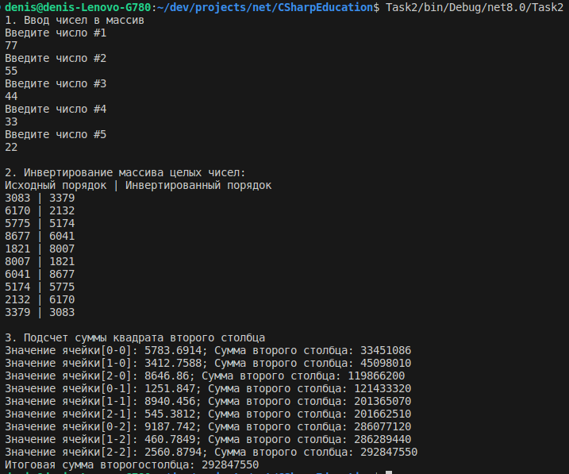

# CSharpEducation
C# .Net Core Educational Solution

## Build
```sh
dotnet build .
```

## Running
Each project is build in its `bin` directory

### Task2


### Task3


### Task5


### Task6


### Task7

